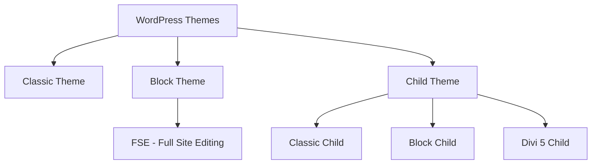

# WordPress 7 Theme Development Playbook

> **Complete reference for classic themes, block themes (FSE), Divi 5 child themes, theme.json, WP 7.0 features, testing, and distribution.**
>
> **Version:** 1.0 | **Last Updated:** July 2026 | **Based on:** WordPress 7.0+, theme.json schema v2

---

## Table of Contents

1. [Official Documentation Sources](#1-official-documentation-sources)
2. [WordPress 7.0 Theme Features](#2-wordpress-70-theme-features)
3. [Theme Types Overview](#3-theme-types-overview)
4. [Classic Theme Development](#4-classic-theme-development)
5. [Block Theme Development (FSE)](#5-block-theme-development-fse)
6. [Theme.json Complete Reference](#6-themejson-complete-reference)
7. [Template Hierarchy](#7-template-hierarchy)
8. [Divi 5 Child Theme Development](#8-divi-5-child-theme-development)
9. [Child Themes (Standard WordPress)](#9-child-themes-standard-wordpress)
10. [Theme Testing](#10-theme-testing)
11. [Theme Distribution & Release](#11-theme-distribution--release)
12. [Quick Reference Cards](#12-quick-reference-cards)

---

## 1. Official Documentation Sources

| Resource | URL |
|----------|-----|
| **Theme Handbook** | https://developer.wordpress.org/themes/ |
| **Block Editor Handbook (Themes)** | https://developer.wordpress.org/block-editor/how-to-guides/themes/ |
| **theme.json Schema** | https://schemas.wp.org/trunk/theme.json |
| **theme.json Schema (GitHub)** | https://github.com/WordPress/gutenberg/blob/trunk/schemas/json/theme.json |
| **Theme Review Guidelines** | https://developer.wordpress.org/themes/releasing-your-theme/theme-review-guidelines/ |
| **WP 7.0 Field Guide** | https://make.wordpress.org/core/2026/05/14/wordpress-7-0-field-guide/ |
| **WP 7.0 RC3 Announcement** | https://wordpress.org/news/2026/05/wordpress-7-0-release-candidate-3/ |
| **Divi 5.1 Release Notes** | https://www.elegantthemes.com/blog/divi-resources/divi-5-1-release-notes |
| **Theme Unit Test Data** | https://codex.wordpress.org/Theme_Unit_Test |
| **Theme Check Plugin** | https://wordpress.org/plugins/theme-check/ |

---

## 2. WordPress 7.0 Theme Features

WP 7.0 shipped with **419+ Core Trac tickets**, **76+ enhancements**, and **300+ bug fixes**. Key theme-relevant changes from the [Field Guide](https://make.wordpress.org/core/2026/05/14/wordpress-7-0-field-guide/):

### 2.1 Modernized Dashboard
- **New admin color scheme and styles** — revamped admin UI
- **View Transitions API in WP Admin** — smooth page transitions
- **Command Palette shortcut** — `Ctrl+K` quick actions
- **Font Library** — built-in font management (install/activate fonts from Google Fonts or upload custom fonts; accessible via theme.json `settings.typography.fontFamilies`)
- **Visual Revisions** — side-by-side visual diff for posts
- **Iframed Editor** — isolated editor rendering for true WYSIWYG
- **Responsive Editing Mode** — preview and edit at different breakpoints directly in the editor
- **Pattern Editing with contentOnly interactivity** — patterns that lock structure but allow content editing

### 2.2 Design Agility
- **Custom CSS on the block level** — per-block CSS in the block inspector
- **New Headings Block** — unified heading block
- **Breadcrumbs Block** — native breadcrumb navigation block
- **Navigation Block** — enhanced menu creation
- **Video embed cover block** — overlay cover images on embedded videos
- **Gallery block** — improved gallery with lightbox support
- **`<p>` Block Supports** — paragraph-level design controls
- **Dimensions Support Enhancements** — aspect ratio, min/max height/width

### 2.3 Developer Toolbox
- **PHP-Only Block Registration** — register blocks server-side without JS build step
- **Interactivity API** — framework for interactive front-end blocks
- **DataViews and DataForms** — new admin data presentation APIs
- **HTML Processing API (HTML Tag Processor + HTML API)** — safer HTML manipulation
- **Template Registration API** — register block templates from plugins
- **Block Hooks** — automatically insert blocks into other blocks

### 2.4 AI Integration
- **WP AI Client** — unified client for AI model access
- **Client-Side Abilities API** — browser-based AI capabilities
- **AI Connectors Screen** — UI for managing AI service connections

### 2.5 New Block Supports in WP 7.0
| Support | Description |
|---------|-------------|
| `blockVisibility` | Hide blocks conditionally per breakpoint |
| `background.backgroundImage` | Set background images on any block |
| `background.backgroundSize` | Control size, position, repeat |
| `dimensions.aspectRatio` | Lock aspect ratios |
| `dimensions.minHeight` | Set minimum heights |
| `position.sticky` | Sticky positioning |
| `typography.lineHeight` | Per-block line height |
| `border` (color, radius, style, width) | Full border controls |

### 2.6 Notable: Real-Time Collaboration Deferred
Real-time collaboration was pulled from 7.0 and re-evaluated for 7.1. Theme developers do not need to account for it yet.

---

## 3. Theme Types Overview



| Type | Template Format | Required Files | FSE Support |
|------|----------------|----------------|-------------|
| **Classic Theme** | `.php` templates | `style.css` + `index.php` | No (but can use theme.json for block styling) |
| **Block Theme** | `.html` templates in `templates/` or `block-templates/` | `style.css` + `templates/index.html` | Yes (fully) |
| **Child Theme** | Inherits parent; can override | `style.css` (with `Template:` header) | Yes (if parent is FSE) |
| **Hybrid** | Mix of `.php` and `.html` | `style.css` + `index.php` + optional `templates/index.html` | Partial |

### Quick Identification
- **Classic theme:** `index.php` exists, no `templates/index.html`
- **Block theme:** `templates/index.html` (or `block-templates/index.html`) exists
- **Hybrid:** Both `index.php` and `templates/index.html`

---

## 4. Classic Theme Development

### 4.1 Minimal Classic Theme Structure

```
my-classic-theme/
├── style.css          # Required — theme header + styles
├── index.php          # Required — fallback template
├── functions.php      # Optional — PHP hooks, theme setup
├── header.php         # Site header
├── footer.php         # Site footer
├── sidebar.php        # Sidebar
├── single.php         # Single post
├── page.php           # Pages
├── archive.php        # Archive pages
├── 404.php            # 404 error page
├── search.php         # Search results
├── screenshot.png     # 1200×900 preview
└── assets/
    ├── css/
    ├── js/
    └── images/
```

### 4.2 style.css — Theme Header

```css
/*
Theme Name: My Classic Theme
Theme URI: https://example.com/my-classic-theme
Author: Your Name
Author URI: https://example.com
Description: A classic WordPress theme for WP 7.0
Version: 1.0.0
Requires at least: 6.0
Tested up to: 7.0
Requires PHP: 8.0
License: GNU General Public License v2 or later
License URI: https://www.gnu.org/licenses/gpl-2.0.html
Text Domain: my-classic-theme
Tags: blog, two-columns, responsive-layout, custom-header
*/
```

### 4.3 index.php — Main Loop

```php
<?php
/**
 * The main template file
 */
get_header(); ?>

<main id="primary" class="site-main">
    <?php if ( have_posts() ) : ?>
        <?php while ( have_posts() ) : the_post(); ?>
            <article id="post-<?php the_ID(); ?>" <?php post_class(); ?>>
                <header class="entry-header">
                    <?php the_title( '<h2 class="entry-title"><a href="' . esc_url( get_permalink() ) . '">', '</a></h2>' ); ?>
                </header>
                <div class="entry-content">
                    <?php the_excerpt(); ?>
                </div>
            </article>
        <?php endwhile; ?>
        
        <div class="pagination">
            <?php the_posts_pagination(); ?>
        </div>
    <?php else : ?>
        <p><?php esc_html_e( 'No posts found.', 'my-classic-theme' ); ?></p>
    <?php endif; ?>
</main>

<?php get_sidebar(); ?>
<?php get_footer(); ?>
```

### 4.4 functions.php — Theme Setup

```php
<?php
/**
 * Theme functions and definitions
 */

// Theme setup
function my_classic_theme_setup() {
    // Add theme support
    add_theme_support( 'title-tag' );
    add_theme_support( 'post-thumbnails' );
    add_theme_support( 'html5', array(
        'search-form',
        'comment-form',
        'comment-list',
        'gallery',
        'caption',
        'style',
        'script',
    ) );
    add_theme_support( 'custom-logo', array(
        'height'      => 100,
        'width'       => 400,
        'flex-height' => true,
        'flex-width'  => true,
    ) );
    add_theme_support( 'responsive-embeds' );
    add_theme_support( 'align-wide' );
    
    // Block editor support
    add_theme_support( 'editor-styles' );
    add_theme_support( 'wp-block-styles' );
    
    // Register navigation menus
    register_nav_menus( array(
        'primary' => esc_html__( 'Primary Menu', 'my-classic-theme' ),
        'footer'  => esc_html__( 'Footer Menu', 'my-classic-theme' ),
    ) );

    // Set content width
    if ( ! isset( $content_width ) ) {
        $content_width = 1200;
    }
}
add_action( 'after_setup_theme', 'my_classic_theme_setup' );

// Enqueue scripts and styles
function my_classic_theme_scripts() {
    wp_enqueue_style(
        'my-classic-theme-style',
        get_stylesheet_uri(),
        array(),
        wp_get_theme()->get( 'Version' )
    );
    
    wp_enqueue_script(
        'my-classic-theme-navigation',
        get_template_directory_uri() . '/assets/js/navigation.js',
        array(),
        wp_get_theme()->get( 'Version' ),
        true
    );
}
add_action( 'wp_enqueue_scripts', 'my_classic_theme_scripts' );
```

### 4.5 header.php

```php
<!DOCTYPE html>
<html <?php language_attributes(); ?>>
<head>
    <meta charset="<?php bloginfo( 'charset' ); ?>">
    <meta name="viewport" content="width=device-width, initial-scale=1">
    <?php wp_head(); ?>
</head>
<body <?php body_class(); ?>>
<?php wp_body_open(); ?>

<header id="masthead" class="site-header">
    <div class="site-branding">
        <?php the_custom_logo(); ?>
        <h1 class="site-title">
            <a href="<?php echo esc_url( home_url( '/' ) ); ?>">
                <?php bloginfo( 'name' ); ?>
            </a>
        </h1>
    </div>
    
    <nav id="site-navigation" class="main-navigation">
        <?php
        wp_nav_menu( array(
            'theme_location' => 'primary',
            'menu_id'        => 'primary-menu',
        ) );
        ?>
    </nav>
</header>
```

### 4.6 Classic Theme with theme.json (Hybrid Approach)

Classic themes CAN use `theme.json` for block editor styling:

```json
{
    "version": 2,
    "settings": {
        "color": {
            "palette": [
                { "slug": "primary", "color": "#1a73e8", "name": "Primary" },
                { "slug": "secondary", "color": "#5f6368", "name": "Secondary" },
                { "slug": "dark", "color": "#202124", "name": "Dark" },
                { "slug": "light", "color": "#ffffff", "name": "Light" }
            ]
        },
        "typography": {
            "fontFamilies": [
                {
                    "fontFamily": "-apple-system, BlinkMacSystemFont, 'Segoe UI', Roboto, sans-serif",
                    "slug": "system",
                    "name": "System Font"
                }
            ]
        },
        "layout": {
            "contentSize": "840px",
            "wideSize": "1200px"
        }
    },
    "styles": {
        "color": {
            "text": "#202124",
            "background": "#ffffff"
        },
        "typography": {
            "fontFamily": "var(--wp--preset--font-family--system)"
        }
    }
}
```

---

## 5. Block Theme Development (FSE)

### 5.1 Minimal Block Theme Structure

```
my-block-theme/
├── style.css                     # Required — theme header
├── theme.json                    # Global settings & styles
├── templates/
│   └── index.html                # Required — default template
├── parts/                        # Template parts
│   ├── header.html
│   └── footer.html
├── patterns/                     # Block patterns
│   └── hero-section.php
├── styles/                       # Style variations
│   └── dark.json
├── functions.php                 # Optional — PHP hooks
├── screenshot.png                # 1200×900 preview
└── README.txt                    # Required for .org submission
```

### 5.2 style.css (Block Theme)

```css
/*
Theme Name: My Block Theme
Theme URI: https://example.com/my-block-theme
Author: Your Name
Description: A modern block theme for WordPress 7.0 full site editing.
Requires at least: 6.6
Tested up to: 7.0
Requires PHP: 8.0
Version: 1.0.0
License: GNU General Public License v2 or later
License URI: https://www.gnu.org/licenses/gpl-2.0.html
Text Domain: my-block-theme
*/
```

### 5.3 templates/index.html — Default Template

```html
<!-- wp:template-part {"slug":"header","theme":"my-block-theme"} /-->

<!-- wp:group {"tagName":"main","layout":{"type":"constrained"}} -->
<main class="wp-block-group">
    <!-- wp:query {"queryId":0,"query":{"perPage":10,"pages":0,"offset":0,"postType":"post","order":"desc","orderBy":"date","author":"","search":"","exclude":[],"sticky":"","inherit":true}} -->
    <div class="wp-block-query">
        <!-- wp:post-template -->
            <!-- wp:post-title {"level":2,"isLink":true} /-->
            <!-- wp:post-date /-->
            <!-- wp:post-excerpt /-->
        <!-- /wp:post-template -->
        
        <!-- wp:query-pagination -->
            <!-- wp:query-pagination-previous /-->
            <!-- wp:query-pagination-numbers /-->
            <!-- wp:query-pagination-next /-->
        <!-- /wp:query-pagination -->
    </div>
    <!-- /wp:query -->
</main>
<!-- /wp:group -->

<!-- wp:template-part {"slug":"footer","theme":"my-block-theme"} /-->
```

### 5.4 parts/header.html

```html
<!-- wp:group {"tagName":"header","className":"site-header","layout":{"type":"constrained"}} -->
<header class="wp-block-group site-header">
    <!-- wp:group {"layout":{"type":"flex","justifyContent":"space-between","flexWrap":"wrap"}} -->
    <div class="wp-block-group">
        <!-- wp:site-logo /-->
        <!-- wp:site-title /-->
        <!-- wp:navigation {"ref":4,"layout":{"type":"flex","justifyContent":"left"}} /-->
    </div>
    <!-- /wp:group -->
</header>
<!-- /wp:group -->
```

### 5.5 parts/footer.html

```html
<!-- wp:group {"tagName":"footer","className":"site-footer","layout":{"type":"constrained"}} -->
<footer class="wp-block-group site-footer">
    <!-- wp:paragraph {"align":"center"} -->
    <p class="has-text-align-center">
        © <!-- wp:site-title {"level":0} /--> <?php echo date('Y'); ?>
    </p>
    <!-- /wp:paragraph -->
</footer>
<!-- /wp:group -->
```

### 5.6 Custom Templates via theme.json

```json
{
    "version": 2,
    "customTemplates": [
        {
            "name": "Full Width Page",
            "slug": "full-width",
            "postTypes": ["page"],
            "title": "Full Width"
        },
        {
            "name": "No Header/Footer",
            "slug": "blank",
            "postTypes": ["page", "post"],
            "title": "Blank Canvas"
        }
    ]
}
```

Then create `templates/full-width.html` and `templates/blank.html`.

### 5.7 Template Parts via theme.json

```json
{
    "version": 2,
    "templateParts": [
        {
            "name": "header",
            "title": "Header",
            "area": "header"
        },
        {
            "name": "footer",
            "title": "Footer",
            "area": "footer"
        },
        {
            "name": "sidebar",
            "title": "Sidebar",
            "area": "uncategorized"
        }
    ]
}
```

### 5.8 Style Variations

Create `styles/dark.json`:

```json
{
    "version": 2,
    "title": "Dark Mode",
    "settings": {},
    "styles": {
        "color": {
            "text": "#f0f0f0",
            "background": "#1a1a2e"
        },
        "elements": {
            "link": {
                "color": {
                    "text": "#64b5f6"
                }
            },
            "button": {
                "color": {
                    "text": "#ffffff",
                    "background": "#4a90d9"
                }
            }
        }
    }
}
```

Style variations appear under **Appearance > Editor > Styles > Browse styles**.

### 5.9 Block Patterns

Create `patterns/hero.php`:

```php
<?php
/**
 * Title: Hero Section
 * Slug: my-block-theme/hero-section
 * Categories: featured, header
 * Description: A full-width hero section with heading and CTA
 */
?>
<!-- wp:cover {"url":"<?php echo esc_url( get_template_directory_uri() ); ?>/assets/images/hero-bg.jpg","dimRatio":50,"align":"full"} -->
<div class="wp-block-cover alignfull">
    <span aria-hidden="true" class="wp-block-cover__background has-black-background-color has-background-dim"></span>
    <div class="wp-block-cover__inner-container">
        <!-- wp:heading {"textAlign":"center","level":1} -->
        <h1 class="has-text-align-center">Welcome to My Site</h1>
        <!-- /wp:heading -->
        <!-- wp:buttons {"layout":{"type":"flex","justifyContent":"center"}} -->
        <div class="wp-block-buttons">
            <!-- wp:button {"backgroundColor":"primary","textColor":"white"} -->
            <div class="wp-block-button"><a class="wp-block-button__link has-white-color has-primary-background-color has-text-color has-background">Get Started</a></div>
            <!-- /wp:button -->
        </div>
        <!-- /wp:buttons -->
    </div>
</div>
<!-- /wp:cover -->
```

### 5.10 functions.php for Block Themes

```php
<?php
/**
 * Block theme functions
 */

function my_block_theme_setup() {
    // Register pattern categories
    if ( function_exists( 'register_block_pattern_category' ) ) {
        register_block_pattern_category( 'hero', array( 'label' => __( 'Hero Sections', 'my-block-theme' ) ) );
        register_block_pattern_category( 'cta', array( 'label' => __( 'Call to Action', 'my-block-theme' ) ) );
    }
    
    // Add block styles
    register_block_style( 'core/button', array(
        'name'  => 'outline-hover',
        'label' => __( 'Outline on Hover', 'my-block-theme' ),
    ) );
}
add_action( 'init', 'my_block_theme_setup' );

// Enqueue editor styles
function my_block_theme_editor_styles() {
    add_editor_style( 'editor-style.css' );
}
add_action( 'after_setup_theme', 'my_block_theme_editor_styles' );
```

---

## 6. Theme.json Complete Reference

### 6.1 Top-Level Structure

```json
{
    "$schema": "https://schemas.wp.org/trunk/theme.json",
    "version": 2,
    "settings": { },
    "styles": { },
    "customTemplates": [ ],
    "templateParts": [ ],
    "patterns": [ ]
}
```

### 6.2 `settings` — Complete Property Map

#### `settings.appearanceTools`
```json
{
    "settings": {
        "appearanceTools": true
    }
}
```
When `true`, enables ALL of: background (image, size), border (color, radius, style, width), color (link, heading, button, caption), dimensions (aspectRatio, minHeight), position (sticky), spacing (blockGap, margin, padding), typography (lineHeight).

#### `settings.color`
```json
{
    "settings": {
        "color": {
            "background": true,
            "text": true,
            "link": false,
            "heading": false,
            "button": false,
            "caption": false,
            "custom": true,
            "customGradient": true,
            "customDuotone": true,
            "defaultPalette": true,
            "defaultGradients": true,
            "defaultDuotone": true,
            "palette": [
                {
                    "slug": "primary",
                    "color": "#007cba",
                    "name": "Primary"
                },
                {
                    "slug": "secondary",
                    "color": "#00669b",
                    "name": "Secondary"
                }
            ],
            "gradients": [
                {
                    "slug": "primary-to-secondary",
                    "gradient": "linear-gradient(135deg, #007cba 0%, #00669b 100%)",
                    "name": "Primary to Secondary"
                }
            ],
            "duotone": [
                {
                    "slug": "dark-grayscale",
                    "colors": ["#000000", "#ffffff"],
                    "name": "Dark Grayscale"
                }
            ]
        }
    }
}
```

#### `settings.typography`
```json
{
    "settings": {
        "typography": {
            "customFontSize": true,
            "dropCap": true,
            "fontStyle": true,
            "fontWeight": true,
            "letterSpacing": true,
            "lineHeight": false,
            "textDecoration": true,
            "textTransform": true,
            "writingMode": false,
            "fontFamilies": [
                {
                    "fontFamily": "'Inter', sans-serif",
                    "slug": "inter",
                    "name": "Inter",
                    "fontFace": [
                        {
                            "fontFamily": "Inter",
                            "fontStyle": "normal",
                            "fontWeight": "400",
                            "src": ["file:./assets/fonts/inter-regular.woff2"]
                        },
                        {
                            "fontFamily": "Inter",
                            "fontStyle": "normal",
                            "fontWeight": "700",
                            "src": ["file:./assets/fonts/inter-bold.woff2"]
                        }
                    ]
                }
            ],
            "fontSizes": [
                {
                    "slug": "small",
                    "name": "Small",
                    "size": "0.875rem"
                },
                {
                    "slug": "medium",
                    "name": "Medium",
                    "size": "1rem"
                },
                {
                    "slug": "large",
                    "name": "Large",
                    "size": "1.5rem"
                },
                {
                    "slug": "x-large",
                    "name": "XL",
                    "size": "2.5rem",
                    "fluid": {
                        "min": "2rem",
                        "max": "4rem"
                    }
                }
            ]
        }
    }
}
```

#### `settings.layout`
```json
{
    "settings": {
        "layout": {
            "contentSize": "840px",
            "wideSize": "1200px",
            "allowEditing": true,
            "allowCustomContentAndWideSize": true
        }
    }
}
```

#### `settings.spacing`
```json
{
    "settings": {
        "spacing": {
            "blockGap": null,
            "margin": true,
            "padding": true,
            "customSpacingSize": true,
            "units": ["px", "em", "rem", "vh", "vw", "%"],
            "spacingScale": {
                "operator": "*",
                "increment": 1.5,
                "steps": 7,
                "mediumStep": 1.5,
                "unit": "rem"
            },
            "spacingSizes": [
                { "slug": "30", "size": "clamp(1.5rem, 5vw, 2rem)", "name": "1" },
                { "slug": "40", "size": "clamp(1.8rem, 1.8rem + ((1vw - 0.48rem) * 2.885), 3rem)", "name": "2" },
                { "slug": "50", "size": "clamp(2.5rem, 8vw, 4.5rem)", "name": "3" }
            ]
        }
    }
}
```

#### `settings.border`
```json
{
    "settings": {
        "border": {
            "color": true,
            "radius": true,
            "style": true,
            "width": true,
            "radiusSizes": [
                { "slug": "small", "size": "4px", "name": "Small" },
                { "slug": "medium", "size": "8px", "name": "Medium" },
                { "slug": "large", "size": "16px", "name": "Large" }
            ]
        }
    }
}
```

#### `settings.dimensions`
```json
{
    "settings": {
        "dimensions": {
            "aspectRatio": true,
            "minHeight": true
        }
    }
}
```

#### `settings.shadow`
```json
{
    "settings": {
        "shadow": {
            "defaultPresets": true,
            "presets": [
                {
                    "slug": "subtle",
                    "shadow": "0 1px 3px rgba(0,0,0,0.12), 0 1px 2px rgba(0,0,0,0.24)",
                    "name": "Subtle"
                },
                {
                    "slug": "medium",
                    "shadow": "0 3px 6px rgba(0,0,0,0.16), 0 3px 6px rgba(0,0,0,0.23)",
                    "name": "Medium"
                }
            ]
        }
    }
}
```

#### `settings.position`
```json
{
    "settings": {
        "position": {
            "sticky": true
        }
    }
}
```

#### `settings.lightbox`
```json
{
    "settings": {
        "lightbox": {
            "enabled": true,
            "allowEditing": true
        }
    }
}
```

#### `settings.background`
```json
{
    "settings": {
        "background": {
            "backgroundImage": true,
            "backgroundSize": true,
            "gradient": true
        }
    }
}
```

#### `settings.blockVisibility` (WP 7.0+)
```json
{
    "settings": {
        "blockVisibility": {
            "allowEditing": true
        }
    }
}
```

### 6.3 `styles` — Complete Reference

#### Top-Level Style Properties

```json
{
    "styles": {
        "color": {
            "text": "#333333",
            "background": "#ffffff",
            "gradient": "linear-gradient(135deg, #ffffff 0%, #f0f0f0 100%)"
        },
        "typography": {
            "fontFamily": "var(--wp--preset--font-family--inter)",
            "fontSize": "1rem",
            "fontStyle": "normal",
            "fontWeight": "400",
            "letterSpacing": "0",
            "lineHeight": "1.6",
            "textDecoration": "none",
            "textTransform": "none"
        },
        "spacing": {
            "blockGap": "1.5rem",
            "margin": {
                "top": "0",
                "right": "0",
                "bottom": "0",
                "left": "0"
            },
            "padding": {
                "top": "0",
                "right": "0",
                "bottom": "0",
                "left": "0"
            }
        },
        "border": {
            "color": "#cccccc",
            "radius": "4px",
            "style": "solid",
            "width": "1px"
        },
        "dimensions": {
            "minHeight": "100vh"
        },
        "shadow": "0 2px 4px rgba(0,0,0,0.1)",
        "outline": {
            "color": "#007cba",
            "offset": "2px",
            "style": "solid",
            "width": "1px"
        },
        "background": {
            "backgroundImage": {
                "url": "file:./assets/images/bg.png",
                "source": "file",
                "id": 0
            },
            "backgroundPosition": "center center",
            "backgroundRepeat": "no-repeat",
            "backgroundSize": "cover"
        },
        "css": "body { font-smooth: always; }"
    }
}
```

#### `styles.elements` — Element-Specific Styles

```json
{
    "styles": {
        "elements": {
            "link": {
                "color": {
                    "text": "#007cba"
                },
                "typography": {
                    "textDecoration": "underline"
                },
                ":hover": {
                    "color": {
                        "text": "#005a87"
                    },
                    "typography": {
                        "textDecoration": "none"
                    }
                },
                ":focus": {
                    "color": {
                        "text": "#005a87"
                    }
                },
                ":active": {
                    "color": {
                        "text": "#003d5c"
                    }
                }
            },
            "heading": {
                "color": {
                    "text": "#111111",
                    "background": "transparent"
                },
                "typography": {
                    "fontFamily": "var(--wp--preset--font-family--inter)",
                    "fontWeight": "700",
                    "lineHeight": "1.3"
                }
            },
            "caption": {
                "color": {
                    "text": "#666666"
                },
                "typography": {
                    "fontSize": "0.875rem"
                }
            },
            "button": {
                "border": {
                    "radius": "4px",
                    "width": "0"
                },
                "color": {
                    "text": "#ffffff",
                    "background": "#007cba"
                },
                "typography": {
                    "fontWeight": "600",
                    "fontSize": "1rem"
                },
                "spacing": {
                    "padding": {
                        "top": "0.75rem",
                        "right": "1.5rem",
                        "bottom": "0.75rem",
                        "left": "1.5rem"
                    }
                },
                ":hover": {
                    "color": {
                        "text": "#ffffff",
                        "background": "#005a87"
                    }
                }
            }
        }
    }
}
```

Supported elements: `link`, `heading`, `caption`, `button`, `h1` through `h6`.

#### `styles.blocks` — Per-Block Styles

```json
{
    "styles": {
        "blocks": {
            "core/paragraph": {
                "typography": {
                    "lineHeight": "1.8"
                },
                "spacing": {
                    "margin": {
                        "bottom": "1.25rem"
                    }
                }
            },
            "core/heading": {
                "typography": {
                    "fontFamily": "var(--wp--preset--font-family--inter)"
                }
            },
            "core/group": {
                "spacing": {
                    "padding": {
                        "top": "2rem",
                        "bottom": "2rem"
                    }
                }
            },
            "core/quote": {
                "border": {
                    "color": "#007cba",
                    "style": "solid",
                    "width": "0 0 0 4px"
                },
                "spacing": {
                    "padding": {
                        "left": "1.5rem"
                    }
                }
            },
            "core/code": {
                "color": {
                    "text": "#f8f8f2",
                    "background": "#282a36"
                },
                "typography": {
                    "fontFamily": "monospace",
                    "fontSize": "0.9rem"
                }
            },
            "core/separator": {
                "color": {
                    "text": "#dddddd"
                },
                "border": {
                    "width": "2px"
                }
            }
        }
    }
}
```

### 6.4 Using CSS `ref()` in theme.json

You can reference other style values:

```json
{
    "styles": {
        "color": {
            "text": "#333333",
            "background": "#ffffff"
        },
        "blocks": {
            "core/quote": {
                "border": {
                    "color": { "ref": "styles.color.text" }
                }
            }
        }
    }
}
```

### 6.5 Preset Variable Naming Convention

theme.json presets generate CSS custom properties following this pattern:

| Preset Type | CSS Variable Pattern | Example |
|------------|---------------------|---------|
| Color palette | `--wp--preset--color--{slug}` | `--wp--preset--color--primary` |
| Gradient | `--wp--preset--gradient--{slug}` | `--wp--preset--gradient--cool-to-warm` |
| Font family | `--wp--preset--font-family--{slug}` | `--wp--preset--font-family--inter` |
| Font size | `--wp--preset--font-size--{slug}` | `--wp--preset--font-size--large` |
| Spacing | `--wp--preset--spacing--{slug}` | `--wp--preset--spacing--40` |
| Border radius | `--wp--preset--border-radius--{slug}` | `--wp--preset--border-radius--small` |
| Shadow | `--wp--preset--shadow--{slug}` | `--wp--preset--shadow--subtle` |

Using presets in style.css:
```css
.my-class {
    color: var(--wp--preset--color--primary);
    font-family: var(--wp--preset--font-family--inter);
    font-size: var(--wp--preset--font-size--large);
}
```

---

## 7. Template Hierarchy

### 7.1 Classic Theme (PHP) Template Hierarchy

WordPress traverses this hierarchy top-to-bottom, using the first matching file.

```
┌──────────────────────────────────────────────────────────────────┐
│                        TEMPLATE HIERARCHY                         │
├──────────────────────────────────────────────────────────────────┤
│                                                                   │
│  HOME PAGE                                                        │
│    front-page.php  →  home.php  →  index.php                      │
│                                                                   │
│  SINGLE POST                                                      │
│    single-{post-type}-{slug}.php                                   │
│    single-{post-type}.php                                          │
│    single-post.php  →  singular.php  →  index.php                 │
│                                                                   │
│  SINGLE PAGE                                                      │
│    page-{slug}.php  →  page-{id}.php  →  page.php                │
│    singular.php  →  index.php                                     │
│                                                                   │
│  CATEGORY ARCHIVE                                                 │
│    category-{slug}.php  →  category-{id}.php  →  category.php    │
│    archive.php  →  index.php                                      │
│                                                                   │
│  TAG ARCHIVE                                                      │
│    tag-{slug}.php  →  tag-{id}.php  →  tag.php                   │
│    archive.php  →  index.php                                      │
│                                                                   │
│  CUSTOM POST TYPE ARCHIVE                                         │
│    archive-{post_type}.php  →  archive.php  →  index.php          │
│                                                                   │
│  AUTHOR ARCHIVE                                                   │
│    author-{nicename}.php  →  author-{id}.php  →  author.php      │
│    archive.php  →  index.php                                      │
│                                                                   │
│  DATE ARCHIVE                                                     │
│    date.php  →  archive.php  →  index.php                        │
│                                                                   │
│  SEARCH RESULTS                                                   │
│    search.php  →  index.php                                       │
│                                                                   │
│  404 PAGE                                                         │
│    404.php  →  index.php                                         │
│                                                                   │
│  ATTACHMENT                                                       │
│    {mime-type}.php  →  attachment.php  →  single-attachment.php  │
│    singular.php  →  index.php                                     │
│                                                                   │
│  PRIVACY POLICY                                                   │
│    privacy-policy.php  →  page.php  →  singular.php  →  index.php│
│                                                                   │
│  EMBED (for embed templates)                                      │
│    embed-{post-type}-{post_format}.php                             │
│    embed-{post-type}.php                                           │
│    embed.php  →  wp-includes/theme-compat/embed.php               │
│                                                                   │
└──────────────────────────────────────────────────────────────────┘
```

### 7.2 Block Theme (HTML) Template Hierarchy

Same hierarchy, but file extensions are `.html`. The `templates/` directory is checked:

```
templates/
├── index.html                      # Fallback (required)
├── front-page.html
├── home.html
├── single.html
├── single-post.html
├── page.html
├── page-{slug}.html
├── archive.html
├── archive-post.html
├── category.html
├── tag.html
├── author.html
├── date.html
├── search.html
├── 404.html
├── singular.html
└── attachment.html
```

If files don't exist in `templates/`, WordPress also checks `block-templates/` (deprecated in favor of `templates/`).

### 7.3 Template Parts Hierarchy

```
parts/
├── header.html
├── footer.html
├── sidebar.html
├── post-meta.html
├── comments.html
└── {custom-name}.html
```

Template parts are referenced via `<!-- wp:template-part {"slug":"header"} /-->` in block templates.

### 7.4 Conditional Tags (Used in classic themes)

```php
<?php if ( is_front_page() && is_home() ) :       // Default homepage ?>
<?php elseif ( is_front_page() ) :                // Static front page ?>
<?php elseif ( is_home() ) :                      // Blog posts index ?>
<?php elseif ( is_single() ) :                    // Single post ?>
<?php elseif ( is_page() ) :                      // Single page ?>
<?php elseif ( is_page_template( 'full-width.php' ) ) : ?>
<?php elseif ( is_category() ) :                  // Category archive ?>
<?php elseif ( is_tag() ) :                       // Tag archive ?>
<?php elseif ( is_author() ) :                    // Author archive ?>
<?php elseif ( is_date() ) :                      // Date archive ?>
<?php elseif ( is_archive() ) :                   // Any archive ?>
<?php elseif ( is_search() ) :                    // Search results ?>
<?php elseif ( is_404() ) :                       // 404 page ?>
<?php elseif ( is_attachment() ) :                // Attachment page ?>
<?php elseif ( is_singular() ) :                  // Any singular post ?>
<?php elseif ( is_post_type_archive( 'product' ) ) : ?>
<?php endif; ?>
```

---

## 8. Divi 5 Child Theme Development

### 8.1 Divi 5 Architecture Changes

Divi 5 is a complete rewrite with:
- **React-based Visual Builder** — faster, modern JS architecture
- **Complete Site Editing** (Divi 5.1+) — edit headers, footers, body layouts, and page content in one step
- **Theme Builder 2.0** — editable theme builder areas
- **Composable Settings** (upcoming) — enable any design setting on any module sub-element
- **Public API** — new APIs for module development

### 8.2 Divi 5 Child Theme Structure

```
divi-5-child/
├── style.css              # Required — child theme header
├── functions.php          # PHP overrides
├── theme.json             # Optional — block editor styling
├── assets/
│   ├── css/
│   │   └── custom.css
│   └── js/
│       └── custom.js
└── et-custom/             # Divi-specific overrides
```

### 8.3 style.css

```css
/*
Theme Name:   Divi 5 Child
Theme URI:    https://example.com/divi-5-child
Description:  Child theme for Divi 5
Author:       Your Name
Author URI:   https://example.com
Template:     Divi
Version:      1.0.0
License:      GNU General Public License v2 or later
License URI:  https://www.gnu.org/licenses/gpl-2.0.html
Text Domain:  divi-5-child
*/
```

> **Critical:** `Template: Divi` must match the parent theme's directory name exactly (case-sensitive).

### 8.4 functions.php — Enqueue Parent & Child Styles

```php
<?php
/**
 * Divi 5 Child Theme Functions
 */

// Enqueue parent and child styles
function divi_5_child_enqueue_styles() {
    // Enqueue parent theme stylesheet
    wp_enqueue_style(
        'divi-parent-style',
        get_template_directory_uri() . '/style.css',
        array(),
        wp_get_theme( 'Divi' )->get( 'Version' )
    );
    
    // Enqueue child theme stylesheet
    wp_enqueue_style(
        'divi-child-style',
        get_stylesheet_uri(),
        array( 'divi-parent-style' ),
        wp_get_theme()->get( 'Version' )
    );
}
add_action( 'wp_enqueue_scripts', 'divi_5_child_enqueue_styles' );
```

### 8.5 Divi 5 PHP Module Override (Custom Module)

```php
<?php
/**
 * Register custom Divi 5 module
 */

function divi_5_child_register_modules() {
    if ( class_exists( 'ET_Builder_Module' ) ) {
        class ET_Builder_Module_Custom_Card extends ET_Builder_Module {
            public $slug       = 'et_pb_custom_card';
            public $vb_support = 'on';
            
            public function init() {
                $this->name = esc_html__( 'Custom Card', 'divi-5-child' );
                $this->icon = '';
                
                $this->settings_modal_toggles = array(
                    'general'  => array(
                        'toggles' => array(
                            'main_content' => esc_html__( 'Content', 'divi-5-child' ),
                            'image'        => esc_html__( 'Image', 'divi-5-child' ),
                        ),
                    ),
                    'advanced' => array(
                        'toggles' => array(
                            'card_styles' => esc_html__( 'Card Styles', 'divi-5-child' ),
                        ),
                    ),
                );
            }
            
            public function get_fields() {
                return array(
                    'title' => array(
                        'label'           => esc_html__( 'Card Title', 'divi-5-child' ),
                        'type'            => 'text',
                        'option_category' => 'basic_option',
                        'toggle_slug'     => 'main_content',
                    ),
                    'content' => array(
                        'label'           => esc_html__( 'Description', 'divi-5-child' ),
                        'type'            => 'tiny_mce',
                        'option_category' => 'basic_option',
                        'toggle_slug'     => 'main_content',
                    ),
                    'card_image' => array(
                        'label'              => esc_html__( 'Card Image', 'divi-5-child' ),
                        'type'               => 'upload',
                        'option_category'    => 'basic_option',
                        'upload_button_text' => esc_attr__( 'Upload Image', 'divi-5-child' ),
                        'choose_text'        => esc_attr__( 'Choose Image', 'divi-5-child' ),
                        'update_text'        => esc_attr__( 'Set As Image', 'divi-5-child' ),
                        'toggle_slug'        => 'image',
                    ),
                );
            }
            
            public function render( $attrs, $content = null, $render_slug ) {
                $title      = $this->props['title'];
                $content    = $this->props['content'];
                $card_image = $this->props['card_image'];
                
                $output = '<div class="custom-card">';
                if ( $card_image ) {
                    $output .= '<div class="custom-card__image"></div>';
                }
                if ( $title ) {
                    $output .= '<h3 class="custom-card__title">' . esc_html( $title ) . '</h3>';
                }
                if ( $content ) {
                    $output .= '<div class="custom-card__content">' . et_core_sanitized_previously( $content ) . '</div>';
                }
                $output .= '</div>';
                
                return $output;
            }
        }
        
        new ET_Builder_Module_Custom_Card();
    }
}
add_action( 'et_builder_ready', 'divi_5_child_register_modules' );
```

### 8.6 Divi 5 Theme Builder Custom Areas

In Divi 5.1+, you can create custom Theme Builder areas:

```php
<?php
/**
 * Register custom theme builder areas for Divi 5
 */
function divi_5_child_register_theme_builder_areas( $areas ) {
    $areas['custom_before_header'] = array(
        'label'    => esc_html__( 'Before Header', 'divi-5-child' ),
        'priority' => 5,
    );
    $areas['custom_after_footer'] = array(
        'label'    => esc_html__( 'After Footer', 'divi-5-child' ),
        'priority' => 95,
    );
    return $areas;
}
add_filter( 'et_theme_builder_template_layouts', 'divi_5_child_register_theme_builder_areas' );
```

### 8.7 Divi 5 CSS Override Snippets

```css
/* Override Divi 5 header */
.et_builder_inner_content .et_pb_section.et_pb_section_0 {
    background-color: #1a1a2e !important;
}

/* Custom button styles that survive Divi 5 updates */
.et_pb_button {
    border-radius: 50px !important;
    font-weight: 700 !important;
    letter-spacing: 0.5px !important;
    transition: all 0.3s ease !important;
}

.et_pb_button:hover {
    transform: translateY(-2px);
    box-shadow: 0 4px 12px rgba(0,0,0,0.2);
}

/* Custom Divi 5 mobile breakpoint overrides */
@media (max-width: 980px) {
    .et_pb_section {
        padding-top: 40px !important;
        padding-bottom: 40px !important;
    }
}
```

### 8.8 Divi 5 + theme.json Integration

Divi 5 child themes can include a `theme.json` file for block editor integration:

```json
{
    "version": 2,
    "settings": {
        "color": {
            "palette": [
                { "slug": "divi-primary", "color": "#2b87da", "name": "Divi Blue" },
                { "slug": "divi-accent", "color": "#7cda24", "name": "Divi Green" }
            ]
        },
        "typography": {
            "fontFamilies": [
                {
                    "fontFamily": "'Open Sans', Arial, sans-serif",
                    "slug": "open-sans",
                    "name": "Open Sans"
                }
            ]
        }
    }
}
```

---

## 9. Child Themes (Standard WordPress)

### 9.1 Minimal Child Theme

```
parent-sunrise/
├── style.css          # Contains: Theme Name, Template: parent-name
├── functions.php      # Optional: enqueue parent styles
└── theme.json         # Optional: override parent theme.json
```

### 9.2 style.css for Standard Child Theme

```css
/*
Theme Name:   Grand Sunrise
Theme URI:    https://example.com/grand-sunrise
Description:  A child theme of Twenty Twenty-Five
Author:       Your Name
Author URI:   https://example.com
Template:     twentytwentyfive
Version:      1.0.0
License:      GNU General Public License v2 or later
License URI:  https://www.gnu.org/licenses/gpl-2.0.html
Text Domain:  grand-sunrise
*/
```

### 9.3 functions.php — Enqueue Parent Styles (Classic)

```php
<?php
function grand_sunrise_enqueue_styles() {
    wp_enqueue_style(
        'parent-style',
        get_template_directory_uri() . '/style.css',
        array(),
        wp_get_theme()->parent()->get( 'Version' )
    );
    wp_enqueue_style(
        'child-style',
        get_stylesheet_uri(),
        array( 'parent-style' ),
        wp_get_theme()->get( 'Version' )
    );
}
add_action( 'wp_enqueue_scripts', 'grand_sunrise_enqueue_styles' );
```

### 9.4 Block Theme Child — theme.json Override

Child theme.json is **merged** with parent theme.json (child values win):

```json
{
    "version": 2,
    "styles": {
        "color": {
            "text": "#1a1a2e",
            "background": "#fafafa"
        },
        "elements": {
            "link": {
                "color": {
                    "text": "#e94e77"
                }
            },
            "heading": {
                "color": {
                    "text": "#16213e"
                }
            }
        }
    }
}
```

### 9.5 What Child Themes Can Override

| Asset | How to Override |
|-------|----------------|
| **style.css** | Child's `style.css` loads after parent |
| **Templates** | Place same-named file in child theme |
| **Template parts** | Place same-named file in child theme |
| **theme.json** | Merged — child values take precedence |
| **Patterns** | Same slug in child's `patterns/` overrides parent |
| **functions.php** | Child's `functions.php` runs AFTER parent |
| **PHP template parts** | `get_template_part()` checks child first |
| **Assets (CSS/JS)** | Enqueue from child theme directory |

### 9.6 Override Priority (Lowest to Highest)

```
WordPress Defaults → Parent Theme → Child Theme → User Customizations (DB)
```

---

## 10. Theme Testing

### 10.1 Theme Unit Test Data

1. Download the [Theme Unit Test XML](https://codex.wordpress.org/Theme_Unit_Test)
2. Go to **Tools > Import > WordPress** and install the WordPress Importer
3. Import the test data XML file
4. Verify: all post formats, long titles, no title, edge cases render correctly

### 10.2 WordPress Settings to Test

| Setting | Test Configuration |
|---------|-------------------|
| **General** | Set Site Title to a very long string; set Tagline even longer |
| **Reading** | "Blog pages show at most" = 5 (triggers pagination) |
| **Discussion** | Enable threaded comments to 3+ levels; break into pages at 5 comments |
| **Media** | Remove large size dimensions; test `$content_width` |
| **Permalinks** | Cycle through Plain, Day/Name, Post Name |

### 10.3 Theme Check Plugin

```bash
# Install and run
wp plugin install theme-check --activate
```

Then go to **Appearance > Theme Check**, select your theme, and run. This is the same automated check WordPress.org uses.

### 10.4 Manual Testing Checklist

- [ ] **All post formats**: standard, aside, gallery, link, image, quote, status, video, audio, chat
- [ ] **Post with no title**
- [ ] **Post with extremely long title**
- [ ] **Comments**: threaded, paginated, no comments, closed comments
- [ ] **Password-protected posts**
- [ ] **Sticky posts**
- [ ] **Pagination**: posts, comments, archive pages
- [ ] **404 page**: nonexistent URLs
- [ ] **Search**: with and without results
- [ ] **Images**: aligned left/right/center/none, captioned, galleries
- [ ] **Embeds**: YouTube, Twitter, etc.
- [ ] **Responsive design**: desktop, tablet, mobile
- [ ] **Browser testing**: Chrome, Firefox, Safari, Edge
- [ ] **RTL languages**: test with WP RTL Tester
- [ ] **Block editor**: all core blocks render correctly
- [ ] **Customizer/Editor**: theme supports reflect correctly
- [ ] **Widget areas** (classic themes only)

### 10.5 Accessibility Testing

- Keyboard navigation through all interactive elements
- Screen reader testing (NVDA or VoiceOver)
- Color contrast ratios (WCAG AA minimum: 4.5:1 for normal text, 3:1 for large text)
- Focus indicators visible on all interactive elements
- `aria-label` on navigation and icon links
- Skip-to-content link present

### 10.6 Debug Mode for Development

Add to `wp-config.php`:

```php
define( 'WP_DEBUG', true );
define( 'WP_DEBUG_LOG', true );
define( 'WP_DEBUG_DISPLAY', false );
define( 'SCRIPT_DEBUG', true );
```

### 10.7 Testing Against Beta/RC WordPress

```bash
# Using WP-CLI
wp core update --version=7.0-RC3

# Or use WordPress Beta Tester plugin
wp plugin install wordpress-beta-tester --activate
```

### 10.8 Performance Testing

```bash
# Check theme load with Query Monitor
wp plugin install query-monitor --activate
```

Key metrics: page load time, database queries, memory usage, asset sizes.

---

## 11. Theme Distribution & Release

### 11.1 Required Files for WordPress.org

| File | Required? | Notes |
|------|-----------|-------|
| `style.css` | **Yes** | Must have valid theme header |
| `templates/index.html` (block) or `index.php` (classic) | **Yes** | Fallback template |
| `screenshot.png` | **No** (but strongly recommended) | 1200×900px |
| `README.txt` | **Yes** (for .org submission) | Theme documentation |
| `theme.json` | No (for block themes, strongly recommended) | |
| `functions.php` | No | |

### 11.2 README.txt Format

```
=== My Theme Name ===
Contributors: yourusername
Requires at least: 6.6
Tested up to: 7.0
Requires PHP: 8.0
Stable tag: 1.0.0
License: GPLv2 or later
License URI: https://www.gnu.org/licenses/gpl-2.0.html

A short description of your theme.

== Description ==

A longer description of what your theme does, who it's for,
and what features it includes.

== Installation ==

1. Upload the theme folder to `/wp-content/themes/`
2. Activate through Appearance > Themes

== Frequently Asked Questions ==

= How do I customize colors? =

Use the Site Editor (Appearance > Editor) to customize
colors, typography, and layout.

== Changelog ==

= 1.0.0 =
* Initial release

== Credits ==

* Based on Twenty Twenty-Five
* Uses Inter font (SIL Open Font License)
```

### 11.3 Theme Review Guidelines (Key Points)

From https://developer.wordpress.org/themes/releasing-your-theme/theme-review-guidelines/:

1. **GPLv2+ Compatible** — theme must be GPL-compatible
2. **No plugin territory** — shortcodes, CPTs, custom blocks must be in plugins
3. **No admin panels that persist after theme switch** — use Customizer or Site Editor
4. **Prefix everything** — functions, classes, handles, slugs, options
5. **Escaping** — all output must be escaped: `esc_html()`, `esc_url()`, `esc_attr()`
6. **Translation-ready** — all strings use `__()` / `_e()` with text domain
7. **No hard-coded scripts/styles** — use `wp_enqueue_*`
8. **Privacy** — no phone-home, tracking without opt-in
9. **Theme Check plugin** must pass with 0 required warnings
10. **3+ distinct issues → auto-closed**

### 11.4 Submission Process

1. Ensure all [required files](#111-required-files-for-wordpressorg) are present
2. Run [Theme Check plugin](#103-theme-check-plugin)
3. Review the [guidelines](https://developer.wordpress.org/themes/releasing-your-theme/theme-review-guidelines/)
4. Create a ZIP of your theme folder
5. Upload to https://wordpress.org/themes/upload/
6. Wait for review (may take days to weeks)
7. Address any reviewer feedback
8. Once approved, your theme appears in the directory

### 11.5 Updating Your Theme

```bash
# Bump version in style.css and README.txt
# Create a new ZIP
# Upload through your theme's admin page on .org
```

For version numbering, use [Semantic Versioning](https://semver.org/): `MAJOR.MINOR.PATCH`

### 11.6 Premium/Distribution Outside .org

- GPL still applies if you distribute the theme
- Consider using Freemius or EDD for licensing
- Provide auto-update mechanism
- Keep documentation separate from theme files

---

## 12. Quick Reference Cards

### 12.1 Block Theme Starter Files

```bash
# Create minimal block theme structure
mkdir -p my-theme/{templates,parts,patterns,styles,assets/{css,js,images}}
touch my-theme/{style.css,theme.json,functions.php,screenshot.png,README.txt}
touch my-theme/templates/index.html
touch my-theme/parts/{header.html,footer.html}
```

### 12.2 Common WordPress Functions for Themes

| Function | Purpose |
|----------|---------|
| `get_header()` | Include header.php |
| `get_footer()` | Include footer.php |
| `get_sidebar()` | Include sidebar.php |
| `get_template_part( $slug, $name )` | Include partial template |
| `wp_head()` | WP head hooks (must be in `<head>`) |
| `wp_footer()` | WP footer hooks (must be before `</body>`) |
| `body_class()` | Output body CSS classes |
| `post_class()` | Output post CSS classes |
| `the_title()` | Output post title |
| `the_content()` | Output post content |
| `the_excerpt()` | Output post excerpt |
| `the_permalink()` | Output post URL |
| `the_post_thumbnail()` | Output featured image |
| `wp_nav_menu()` | Output navigation menu |
| `language_attributes()` | Output `<html>` lang attributes |
| `bloginfo( 'name' )` | Site name |
| `bloginfo( 'charset' )` | Character encoding |
| `home_url()` | Site home URL |
| `get_template_directory_uri()` | Parent theme URL |
| `get_stylesheet_directory_uri()` | Child theme URL |
| `esc_html()` | Escape HTML output |
| `esc_url()` | Escape URLs |
| `esc_attr()` | Escape HTML attributes |

### 12.3 Block Theme Block Shortcuts

| Block | Markup |
|-------|--------|
| Site Title | `<!-- wp:site-title /-->` |
| Site Logo | `<!-- wp:site-logo /-->` |
| Site Tagline | `<!-- wp:site-tagline /-->` |
| Navigation | `<!-- wp:navigation {"ref":4} /-->` |
| Post Title | `<!-- wp:post-title /-->` |
| Post Content | `<!-- wp:post-content /-->` |
| Post Date | `<!-- wp:post-date /-->` |
| Post Excerpt | `<!-- wp:post-excerpt /-->` |
| Post Featured Image | `<!-- wp:post-featured-image /-->` |
| Query Loop | `<!-- wp:query -->...<!-- /wp:query -->` |
| Post Template | `<!-- wp:post-template -->...<!-- /wp:post-template -->` |
| Template Part | `<!-- wp:template-part {"slug":"header"} /-->` |
| Login/out Link | `<!-- wp:loginout /-->` |
| Page List | `<!-- wp:page-list /-->` |

### 12.4 Common WP-CLI Commands for Theme Dev

```bash
# Create a blank theme structure
wp scaffold _s my-theme --theme_name="My Theme"

# Create a block theme skeleton
wp scaffold block-theme my-block-theme --theme_name="My Block Theme"

# Create a child theme
wp scaffold child-theme my-child --parent_theme=twentytwentyfive --theme_name="My Child"

# Check theme requirements
wp theme check my-theme

# Export current theme
wp theme export my-theme --zip

# Test theme activation
wp theme activate my-theme

# Generate theme test data
wp post generate --count=10

# Check for PHP errors
wp eval "phpinfo();"
```

### 12.5 ESLint/Prettier Config for Theme JS

```json
{
    "extends": ["@wordpress/eslint-plugin/recommended"],
    "env": {
        "browser": true,
        "jquery": true
    },
    "globals": {
        "wp": true,
        "et_fb": true,
        "Divi": true
    }
}
```

### 12.6 Theme PHPCS Configuration

```bash
# Install WordPress coding standards
composer require --dev wp-coding-standards/wpcs
./vendor/bin/phpcs --config-set installed_paths vendor/wp-coding-standards/wpcs

# Run the check
./vendor/bin/phpcs --standard=WordPress wp-content/themes/my-theme/
```

### 12.7 Build Script (package.json example)

```json
{
    "name": "my-block-theme",
    "version": "1.0.0",
    "scripts": {
        "build": "wp-scripts build",
        "start": "wp-scripts start",
        "lint:js": "wp-scripts lint-js",
        "lint:css": "wp-scripts lint-style",
        "format": "wp-scripts format",
        "check-engines": "wp-scripts check-engines",
        "zip": "wp-scripts plugin-zip"
    },
    "devDependencies": {
        "@wordpress/scripts": "^27.0.0"
    }
}
```

---

## Appendix A: Quick Decision Tree

```
Starting a new theme project?
├─ Simple blog/portfolio? → Block theme (fastest to build, FSE)
├─ Complex custom functionality? → Classic theme or Hybrid
├─ Building on existing theme? → Child theme
├─ Using Divi builder? → Divi 5 child theme
├─ .org directory submission? → Follow Releasing guidelines (§11)
└─ Client project with future customization? → Block theme + theme.json
```

## Appendix B: Version Compatibility

| WordPress Version | theme.json Version | Block Themes | FSE |
|------------------|-------------------|--------------|-----|
| 5.8 | 1 (experimental) | No | No |
| 5.9 | 2 | Yes | Yes |
| 6.0 | 2 | Yes | Yes |
| 6.1–6.7 | 2 | Yes | Yes |
| 7.0 | 2 | Yes | Yes |

## Appendix C: Key URLs Summary

| Resource | URL |
|----------|-----|
| Theme Handbook | https://developer.wordpress.org/themes/ |
| Global Settings & Styles | https://developer.wordpress.org/themes/global-settings-and-styles/ |
| theme.json Schema | https://schemas.wp.org/trunk/theme.json |
| Template Hierarchy | https://developer.wordpress.org/themes/classic-themes/basics/template-hierarchy/ |
| Child Themes | https://developer.wordpress.org/themes/advanced-topics/child-themes/ |
| Theme Testing | https://developer.wordpress.org/themes/releasing-your-theme/testing/ |
| Theme Review Guidelines | https://developer.wordpress.org/themes/releasing-your-theme/theme-review-guidelines/ |
| Requirements | https://developer.wordpress.org/themes/releasing-your-theme/required-theme-files/ |
| WP 7.0 Field Guide | https://make.wordpress.org/core/2026/05/14/wordpress-7-0-field-guide/ |
| Block Editor: Themes | https://developer.wordpress.org/block-editor/how-to-guides/themes/ |
| Divi 5.1 Release | https://www.elegantthemes.com/blog/divi-resources/divi-5-1-release-notes |

---

> **This playbook covers WordPress 7.0 theme development end-to-end. For the latest updates, always check the official [Theme Handbook](https://developer.wordpress.org/themes/) and the [Make WordPress Core blog](https://make.wordpress.org/core/).**
