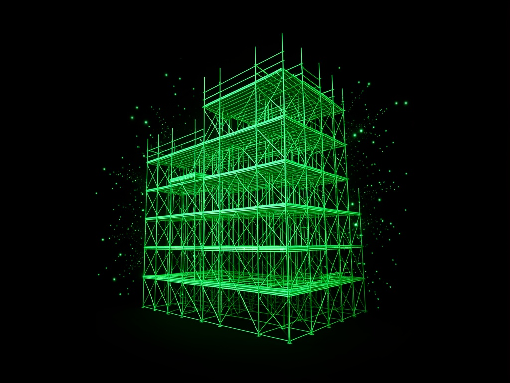

# DigitalStudioz — Full-Service Digital Studio

**Think Big. Build Bold.** Premium scroll-driven showcase for 3D web experiences, AI integration, full-stack development, and automation.

[](https://github.com/jonbeatz/DigitalStudioz)
[](https://github.com/jonbeatz/DigitalStudioz/releases)
[](https://github.com/jonbeatz/DigitalStudioz/releases)
[](https://github.com/jonbeatz/DigitalStudioz)
[](LICENSE)
[](https://nextjs.org)
[](https://docs.pmnd.rs/react-three-fiber)
[](https://jonbeatz.github.io/DigitalStudioz/)


---

> **Single source of truth:** Read **[`TRUTH.md`](TRUTH.md)** first, then **[`.cursor/docs/START-HERE.md`](.cursor/docs/START-HERE.md)**.

## Current Status

| Metric | Value |
| :--- | :--- |
| **Version** | `v0.3.0` · [Latest release](https://github.com/jonbeatz/DigitalStudioz/releases) |
| **Stack** | Next.js 16 (App Router) + Three.js / R3F / Drei + GSAP + Lenis + SplitType |
| **3D Engine** | Procedural abstract geometry — icosahedron, wireframe torus knot, orbiting spheres |
| **Live Preview** | [jonbeatz.github.io/DigitalStudioz](https://jonbeatz.github.io/DigitalStudioz/) |
| **Memory** | Mem0 + Qdrant (`digitalstudioz_memories` collection) |
| **AI Backend** | LiteLLM (DeepSeek V4 proxy) + LM Studio (local) |
| **Verified** | `npm run build` — clean static generation |
| **Status** | Active development — `DigitalStudioz-Project-v1` branch |

---

## Screenshots

### Hero — MAVRA-generated full-bleed image


*Full-bleed hero with FLUX-generated imagery, Studio Green accent, and scroll-driven 3D atmosphere.*

### Chapter sections — alternating image + card layout


*Five chapters with custom MAVRA assets, SplitType line reveals, and GSAP scroll animations.*

---

## 1. Project Overview

DigitalStudioz is a **full-service digital studio showcase** demonstrating what the JonBeatz ecosystem can build:

- Config-driven **Experience Engine** ported from VaderLabz
- **Studio Green** design system (`#22c55e` / `#34d399`) on deep black surfaces
- **MAVRA Build Pipeline** — 11 FLUX-generated images with `ds-` naming convention
- Procedural 3D scene as atmospheric background (subtle wireframe + orbiting spheres)
- Lenis smooth scroll + GSAP ScrollTrigger + SplitType text reveals
- Hermes profile infrastructure — Mem0, Draven memory, session rituals, backup scripts

**Profile root:** `D:\Hermes\projects\DigitalStudioz`

---

## 2. Tech Stack

| Layer | Technology | Purpose |
|-------|-----------|---------|
| **Framework** | Next.js 16 (App Router, React 19) | Frontend + routing |
| **3D Engine** | Three.js / React-Three-Fiber / Drei | Procedural geometry + HDR environments |
| **Post-FX** | @react-three/postprocessing | Bloom and scene polish |
| **Animation** | GSAP + ScrollTrigger | Scroll-driven reveals |
| **Scroll** | Lenis | Smooth scroll foundation |
| **Typography** | SplitType | Line-by-line chapter title reveals |
| **Styling** | Tailwind CSS v4 + CSS tokens | Studio Green design system |
| **AI Agent** | Draven (Hermes co-pilot) | Cross-session AI assistant |
| **Memory** | Mem0 + Qdrant (local) | Isolated `digitalstudioz_memories` |
| **Deploy** | GitHub Pages (static export) + optional Hostinger | Preview + production |

---

## 3. Pages & Routes

| Route | Description |
|-------|-------------|
| **`/`** | Main showcase — hero image, 5 chapters, stats strip, contact |

---

## 4. Quick Start

```powershell
git clone https://github.com/jonbeatz/DigitalStudioz.git
cd DigitalStudioz
npm install
copy .env.local.example .env.local   # then edit Mem0 vars if needed
npm run dev                            # http://localhost:3000
```

Verify the baseline gate:

```powershell
npm run build
```

**Agent ritual:** Say **Start Project** in Cursor for full cold-start — see [START-HERE.md](.cursor/docs/START-HERE.md).

---

## 5. Architecture

```
DigitalStudioz/
├── app/
│   ├── page.tsx              # Config wrapper (~70 lines)
│   ├── layout.tsx            # Fonts, Lenis, CustomCursor
│   └── globals.css           # Studio Green design tokens
├── lib/experience-engine/
│   ├── engine.tsx            # createStudioExperience(config)
│   ├── config.ts             # HDR presets, bloom, colors
│   ├── scene/                # Scene3D, SceneModel (procedural)
│   └── ui/                   # Hero, chapters, rails, picker
├── public/
│   ├── images/               # MAVRA FLUX assets (ds-*.jpg)
│   └── media/                # HDR environment maps (.exr)
├── scripts/
│   └── project-backup.mjs    # G:\Hermes_Project_BackUpz\DigitalStudioz\
└── .cursor/docs/             # START-HERE, ReCall, GITHUB-SETUP
```

---

## 6. Available Commands

| Command | Description |
|---------|-------------|
| `npm run dev` | Dev server on port 3000 |
| `npm run build` | Production build |
| `npm run build:pages` | Static export for GitHub Pages |
| `npm run session:start:full` | Cold boot — DeepSeek + ngrok + Mem0 |
| `npm run mem0:search -- "query"` | Search project memories |
| `npm run backup:quick` | Standard backup (no prompts) |

Full reference: [MASTER-COMMANDS.md](.cursor/docs/MASTER-COMMANDS.md)

---

## 7. Documentation

| Document | Purpose |
|----------|---------|
| [TRUTH.md](TRUTH.md) | Profile constitution |
| [START-HERE.md](.cursor/docs/START-HERE.md) | Daily ops + brand tokens |
| [ReCall.md](.cursor/docs/ReCall.md) | Session history |
| [GITHUB-SETUP.md](.cursor/docs/GITHUB-SETUP.md) | Repo, branches, Pages, releases |
| [DIGITALSTUDIOZ-PLAN.md](.cursor/plans/DIGITALSTUDIOZ-PLAN.md) | Original build plan |

---

## 8. Design System — Studio Green

| Token | Value |
|-------|-------|
| Accent | `#22c55e` |
| Secondary | `#34d399` |
| Background | `#050505` / `#111111` |
| Gradient | `linear-gradient(135deg, #22c55e, #34d399)` |
| Tagline | Think Big. Build Bold. |

---

## License

MIT — see [LICENSE](LICENSE).

---

*Part of the [JonBeatz](https://github.com/jonbeatz) ecosystem.*
